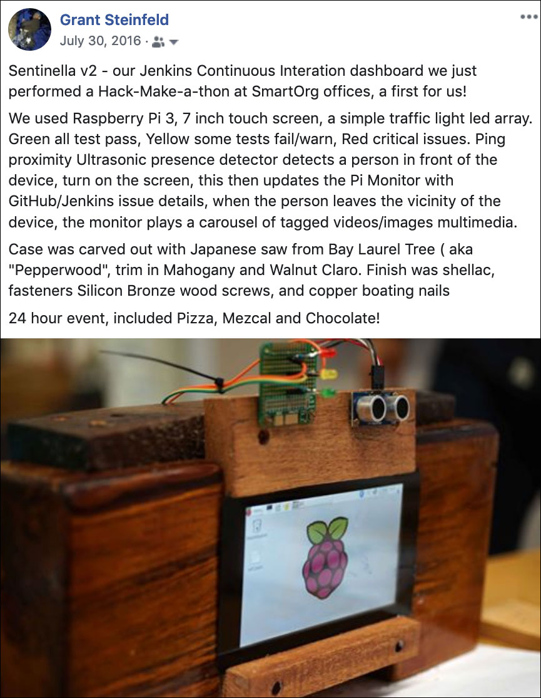

## Grant Steinfeld - IoT project gallery

### Sentinella v2 - a Jenkins based CI/CD IoT desktop monitor (July, 2016)

```bash
SmartOrg developers conducted a fun, 

and innovative hack/make-a-thon to build a 

GitHub / TravisCI 

realtime CI/CD raspberry pi dashboard

to detect failing or passing builds


```



Want to try make something similar?  [Here is how we made it](https://github.com/Grant-Steinfeld/sentinella)

